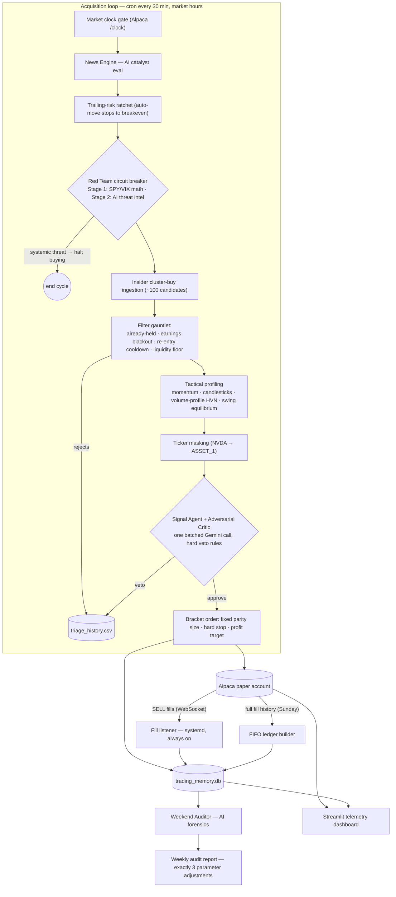

# ai-trader — architecture showcase

An autonomous, AI-driven equities trading pipeline running headless on an Oracle Linux VM against an **Alpaca paper account**. Five Gemini agents propose; hardcoded deterministic gates dispose.

**This repository is a showcase, not the source.** It documents the architecture and the production engineering behind the system — the full implementation (agent prompts, strategy logic, filter calibration) is private. A selection of infrastructure code is included in [`engineering/`](engineering/); 

> ⚠️ Educational project. Paper trading only. Nothing here is financial advice.
>
> **Status: under active development.** Filters and risk parameters are still being tuned, so historical performance data spans inconsistent configurations and isn't published. A track record will be added once the configuration stabilizes long enough to measure honestly.

## Pipeline at a glance

Four clocks, five AI agents, two sources of truth. (**[▶ Interactive diagram](https://nguyenaax.github.io/ai-trader/docs/pipeline.html)** · [architecture blueprint](docs/architecture.md).)



### The five AI agents

| Agent | Job |
|---|---|
| News catalyst evaluator | Filters live headlines into actionable event-driven catalysts; hash-cache dedupes so nothing is paid for twice |
| Red Team threat analyst | Reads top macro headlines hunting a strict, enumerated set of systemic threats; halts acquisitions, never touches open-position protection |
| Signal Agent | Builds the bullish thesis from sector profile + technical payload — on **masked** tickers so brand priors can't leak in |
| Adversarial Critic | Attacks that thesis in the same batched call; a set of hard technical veto rules overrides any enthusiasm |
| Weekend Auditor | Low-temperature forensic audit of the broker-reconciled ledger; must return exactly 3 data-backed parameter adjustments |

All calls run Gemini 2.5 Flash with automatic fallback to a lighter model on quota errors, wrapped in exponential-backoff retry ([`engineering/network_utils.py`](engineering/network_utils.py)).

### Design stance: agents propose, gates dispose

Position sizing, stop, and target are hardcoded outside the LLM context window — no agent can change them. Every rejection lands in `triage_history.csv` with a reason, so the funnel is auditable end to end. Safety checks fail **closed** (market clock, cooldown, liquidity); only the AI threat check fails open so a flaky API can't strand the bot.

## Engineering highlights (production findings)

These came from operating the system live and are the core of the project:

1. **Broker reconciliation pipeline** ([`engineering/build_reconciled_ledger.py`](engineering/build_reconciled_ledger.py)). The bot's self-log drifted from the broker (missed exit fills, unlogged bracket legs). Rebuilt an authoritative ledger by FIFO-matching every real Alpaca fill into round-trip trades — **validated 1:1 against live broker positions with zero quantity mismatches** — and repointed all analytics (dashboard KPIs, weekend audit) at it. The drift detector is [`engineering/reconcile_alpaca.py`](engineering/reconcile_alpaca.py).

2. **Found the real loss driver.** Fill-history analysis showed the dominant share of realized losses came from stop-market orders gapping through the hard stop on illiquid micro-caps, filling well below the trigger. Not a code bug — a market-microstructure problem the self-log had obscured.

3. **Data-calibrated liquidity gate.** A threshold sweep with a time-split robustness check showed a single dollar-volume floor cleanly separates the slippage-prone names; a volatility/ATR gate was tested and **rejected** because it forfeited liquid winners.

4. **Race condition: "revenge orders."** The re-entry cooldown only triggered on *realized* losses; while a position was still open, its P&L was NULL, so nothing matched and the bot stacked duplicate entries at ~2× intended exposure. Re-keyed the guard on entry timestamps and open-position state; recurrence: zero.

5. **A filter that had silently never worked.** The earnings-blackout check used `timedelta` without importing it; the `NameError` was swallowed by a broad `try/except: pass`, so every earnings check failed open. Found during an unrelated integration, fixed, and proven with a monkeypatched-earnings test. Lesson: verify filters *fire*, not just that code imports.

6. **Ops hardening.** The fill listener runs as a `Restart=always` systemd service ([`deploy/`](deploy/)) — it silently not-running was the root cause of the ledger drift. The candidate scraper treats HTTP-200 soft-block pages as retryable network failures. The weekly audit retries transient LLM 503s so a capacity spike can't cost a week's report.

## What's in this repo

```
docs/architecture.md                  # full system blueprint
docs/pipeline.html                    # interactive pipeline diagram
engineering/build_reconciled_ledger.py   # FIFO broker-reconciliation (data integrity)
engineering/reconcile_alpaca.py          # DB ↔ broker drift detector
engineering/network_utils.py             # LLM retry/backoff + model-fallback plumbing
engineering/alpaca_listener.py           # WebSocket fill listener (systemd service)
deploy/                               # crontab + systemd unit samples
```

The excerpts are real files from the private repo, chosen because they demonstrate infrastructure craft without disclosing agent prompts or strategy logic.

## Stack

Python · Google Gemini (multi-model fallback) · Alpaca Trading API (REST + WebSocket) · Finnhub · yfinance · SQLite (WAL) · Streamlit · systemd + cron · Discord webhooks · Oracle Linux VM
